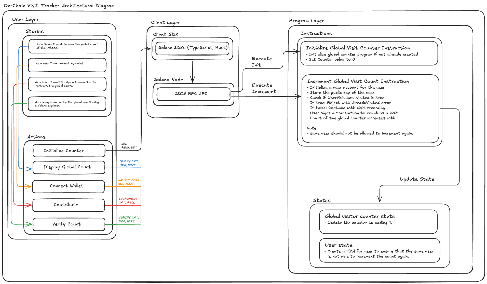

# On-Chain Visit Tracker

On-Chain Visit Tracker is a decentralized website visit counter built on Solana using Anchor. Each unique wallet can record a single visit to the website, with all visit data stored transparently on-chain and verifiable through Solana's blockchain.

## User Stories

See [User-Story.md](./User-Story.md) for detailed user stories and acceptance criteria.

## Architectural Diagram



*Architecture showing the three-layer structure: User Layer (stories & actions), Client Layer (SDK & RPC), and Program Layer (instructions and states).*

## Setup & Usage

> **Prerequisites:** Ensure you have Rust, Anchor framework, and Node.js installed. For local development, you'll need Solana CLI tools.

### 1. Clone the repository
```bash
git clone https://github.com/kabir-fx/On-Chain-Visit-Tracker.git
cd On-Chain-Visit-Tracker
```

### 2. Install dependencies

```bash
npm install
```

### 3. Setup the program

This will sync the program ID, build the program, and generate the TypeScript client.

```bash
npm run setup
```

### 4. Build the program

Build the Anchor program

```bash
npm run anchor-build
```

### 5. Run tests

Test the smart contract functionality.

```bash
npm run anchor-test
```

### 6. Start the web application

Start the Next.js frontend application.

```bash
npm run dev
```

### 8. Deploy to Devnet (optional)

Deploy the program to Solana devnet.

```bash
npm run anchor deploy --provider.cluster devnet
```

## Features

- **Initialize Counter**: Create the global visit counter on-chain (one-time setup).
- **Record Visit**: Users can sign a transaction to record their website visit.
- **Unique Tracking**: Each wallet address can only record one visit using PDA-based tracking.
- **View Global Count**: Display the total number of unique visits without transaction fees.
- **Blockchain Verification**: Verify visit counts using Solana Explorer for transparency.

## Security

- Each wallet can only record one visit, preventing duplicate counting through PDA-based user tracking.
- The global counter is program-owned (PDA), ensuring only authorized program logic can modify it.
- All operations are verified on-chain through Solana's program logic.
- Visit data is tamper-proof and publicly verifiable via blockchain explorers.
- Uses checked arithmetic to prevent integer overflow attacks.
